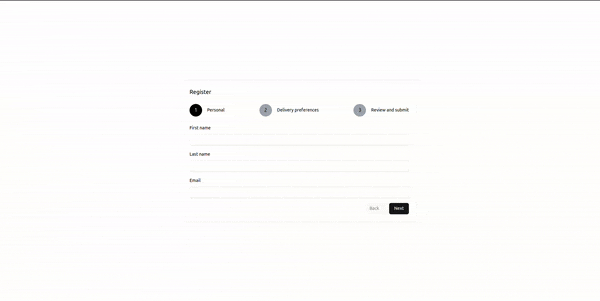

# Form wizard

<p align="center">
  
</p>

This project consists of two main components:

- **API**: A backend application built with NestJS.
- **Web**: A frontend application built with React and Vite.

## Prerequisites

To set up and run this project locally, you will need:

- **Node.js** version 20.18.0 or higher
- **Yarn** as the package manager

## Getting Started

### 1. Clone the Repository

Clone the project repository and navigate into the project directory:

```bash
git clone git@github.com:guimap01/form-wizard.git
cd form-wizard
```

### 2. Setup Environment Variables

Both the API and Web applications require environment variables to be configured. For each application:

Navigate to the respective folder (api for backend, web for frontend).
Copy the .env.example file to .env.
Use the following commands for both folders:

```bash
cd api
cp .env.example .env
cd ..
```

In the Web folder

```bash
cd web
cp .env.example .env
cd ..
```

### 3. Start the Database

This project uses PostgreSQL as its database, which is set up via Docker. Make sure Docker is installed (https://www.docker.com/products/docker-desktop/) and running, then execute the following command from the root of the project (above the api and web folder) to start the database:

```bash
docker-compose up -d
```

After setting up the environment and starting the database, you can now run each application.

API (NestJS)
Navigate to the api folder.
Ensure the environment variables are configured and that the database is running.
Start the API with the following command:

```bash
cd api
yarn start:dev
```

This will start the NestJS API in development mode.

Web (React with Vite)
Navigate to the web folder.
Ensure the environment variables are configured.
Start the frontend application with:

```bash
cd web
yarn dev
```

This will start the Vite-powered React application in development mode.

Notes
The project is built using Yarn, so using Yarn for installing dependencies and running scripts is recommended.
Make sure Node.js v20.18.0 or above is installed, as this project may not be compatible with earlier versions.
